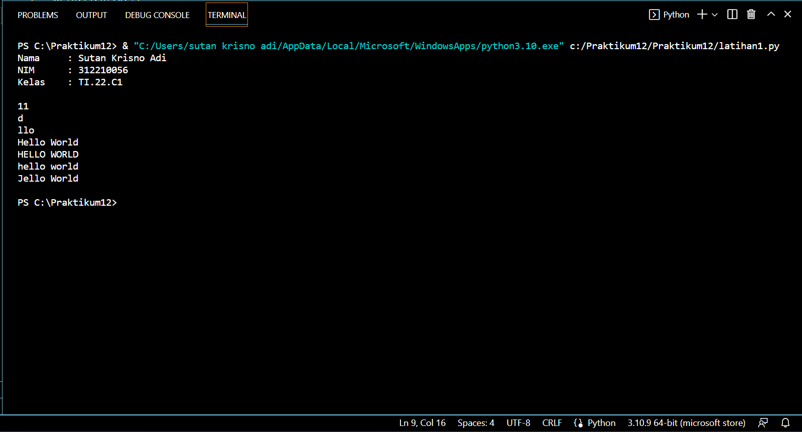
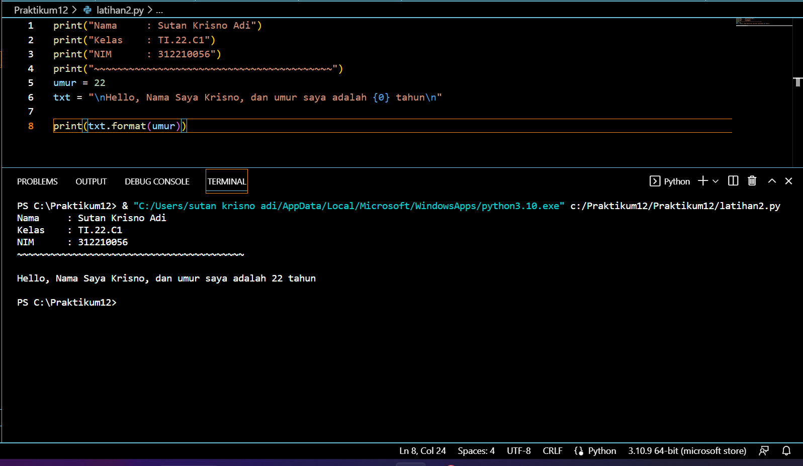

# Praktikum12

Nama    : Sutan Krisno Adi
NIM     : 312210056
Kelas   : TI.22.C1

## Python String
 - String adalah jenis yang paling populer di Python.
 - Untuk membuatnya hanya dengan melampirkan karakter dalam tanda kutip.
 - Python memperlakukan tanda kutip tunggal (' ') sama dengan tanda kutip ganda (" ").
 - Membuat string semudah memberi nilai pada sebuah variabel.

# Latihan 1
txt = 'Hello World'
 - Hitung jumlah karakter
 - Ambil karakter terakhir
 - Ambil karakter index ke-2 sampai index ke-4 (llo)
 - Hilangkan spasi pada text tersebut (HelloWorld)
 - Ubah tect menjadi huruf besar
 - Ubah tect menjadi huruf kecil
 - Ganti karakter H menjadi karakter J

 Penjelasan Latihan 1
 - Untuk menghitung jumlah karakter, gunakan fungsi len().
           
            print(len(txt))

 - Cara mengambil satu karakter pada string yaitu dengan menggunakan kurung siku [] dan deklarasi nomor di dalam kurung siku dengan urutan ARRAY dan menggunakan titik dua lalu masukan nomor ARRAY selanjutnya. Untuk mengambil karakter terakhir, gunakan *index [-1]**. Sedangkan untuk mengambil karakter *index ke-2 sampai ke-4, gunakan index [2:5].
           
            print(txt[-1])
            print(txt[2:5])

 - Jika ingin menghilangkan spasi pada string, gunakan method replace(). Method replace() mengganti semua kemunculan string lama dengan yang baru atau paling banyak kemunculan.
 - Di dalam method replace, kita dapat menggunakan 2 cara, yang pertama bisa menggunakan (txt.replace(" ", "")) dan kedua dengan cara (txt.replace(txt[5], "")).
           
            print(txt.replace(" ", " "))

 - Untuk mengubah text menjadi huruf besar, gunakan method upper(). Sedangkan jika ingin mengubah text menjadi huruf kecil, menggunakan method lower().
           
            print(txt.upper())
            print(txt.lower())

 - Untuk mengganti karakter 'H' menjadi karakter 'J', gunakan method replace().
           
            print(txt.replace("h", "J"))
            print()

## Output Latihan 1

# Latihan 2
Lengkapi kode berikut
    umur = 22
    txt = 'Hello, nama saya krisno, dan umur saya adalah ... tahun'

    print(txt.format(umur))

Penjelasan Latihan 2

Untuk memasukan variabel kedalam string, tambahkan kurung kurawa {} untuk menempatkan variabel sebelumnya.

        umur = 22
        txt = "\nHello, Nama Saya Krisno, dan umur saya adalah {0} tahun\n"

        print(txt.format(umur))

## Output Latihan 2

Duduk Kesepian Tanpa Kekasih
Cukup Sekian dan Terima Kasih
:)